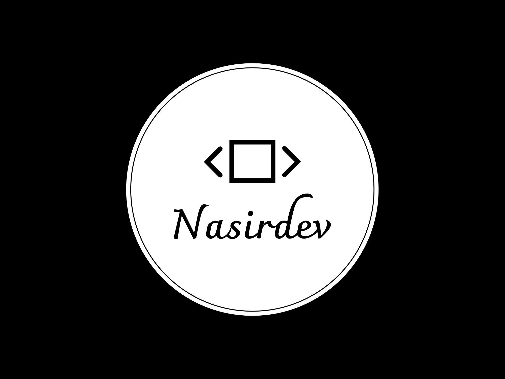

<a name="readme-top"></a>


<div align="center">
  
  
  <br/>

  <h3><b>ODIN'S RECIPE PROJECT</b></h3>

</div>

<!-- TABLE OF CONTENTS -->

# 📗 Table of Contents

- [📖 About the Project](#about-project)
  - [🛠 Built With](#built-with)
    - [Tech Stack](#tech-stack)
    - [Key Features](#key-features)
  - [🚀 Live Demo](#live-demo)
- [💻 Getting Started](#getting-started)
  - [Setup](#setup)
  - [Prerequisites](#prerequisites)
  - [Install](#install)
  - [Usage](#usage)
  - [Run tests](#run-tests)
  - [Deployment](#triangular_flag_on_post-deployment)
- [👥 Authors](#authors)
- [🔭 Future Features](#future-features)
- [🤝 Contributing](#contributing)
- [⭐️ Show your support](#support)
- [🙏 Acknowledgements](#acknowledgements)
- [📝 License](#license)

<!-- PROJECT DESCRIPTION -->

# 📖 MY NEW PROJECT <a name="about-project"></a>

This project is part of the HTML Foundations.

## 🛠 Built With <a name="built-with"></a>

1.HTML

2.CSS

### Tech Stack <a name="tech-stack"></a>

The project is built using HTML and CSS.

<details>
  <summary>Client</summary>
  <ul>
    <li><a href="/index.html">HTML</a></li>
    <li><a href="/style.css">CSS</a></li>
  </ul>
</details>

<!-- Features -->

### Key Features <a name="key-features"></a>

Coming soon.

<p align="right">(<a href="#readme-top">back to top</a>)</p>

<!-- LIVE DEMO -->

## 🚀 Live Demo <a name="live-demo"></a>

Coming soon.

<p align="right">(<a href="#readme-top">back to top</a>)</p>

<!-- GETTING STARTED -->

## 💻 Getting Started <a name="getting-started"></a>

To get a local copy up and running, follow these steps.

### Prerequisites

In order to run this project you need:

1. Web browser.
2. Code editor.
3. Version control system. For example git-scm

### Setup

Clone this repository to your desired folder:
Run the following commands.

```sh
  cd my-folder
  git clone https://github.com/NasirSethe/Odin-Recipes.git
```

### Install

Install this project with:

Run this command:

```sh
  cd my-project
  npm install
```

### Usage

To run the project, execute the following command:

Open index.html file using the live server extension in your code editor.

### Run tests

Coming soon.

### Deployment

Coming soon.

<p align="right">(<a href="#readme-top">back to top</a>)</p>

<!-- AUTHORS -->

## 👥 Authors <a name="authors"></a>

👤 Abdi Nasir Daud Sethe

- GitHub: [NasirSethe](https://github.com/NasirSethe)
- Twitter: [@SetheNasir](https://twitter.com/SetheNasir)
- LinkedIn: [Abdi Nasir Sethe](https://www.linkedin.com/in/abdi-nasir-sethe-305a86263/)

<p align="right">(<a href="#readme-top">back to top</a>)</p>

<!-- FUTURE FEATURES -->

## 🔭 Future Features <a name="future-features"></a>

Coming soon.

<p align="right">(<a href="#readme-top">back to top</a>)</p>

<!-- CONTRIBUTING -->

## 🤝 Contributing <a name="contributing"></a>

Contributions, issues, and feature requests are welcome!

<p align="right">(<a href="#readme-top">back to top</a>)</p>

<!-- SUPPORT -->

## ⭐️ Show your support <a name="support"></a>

If you like the project feel free to give it a star ⭐️

<p align="right">(<a href="#readme-top">back to top</a>)</p>

<!-- ACKNOWLEDGEMENTS -->

## 🙏 Acknowledgments <a name="acknowledgements"></a>

I would like to thank fellow micronauts and the entire microverse team!

<p align="right">(<a href="#readme-top">back to top</a>)</p>

<!-- LICENSE -->

## 📝 License <a name="license"></a>

This project is [MIT](./LICENSE) licensed.

<p align="right">(<a href="#readme-top">back to top</a>)</p>


